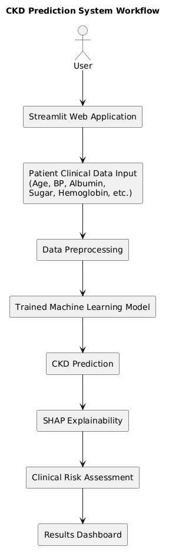
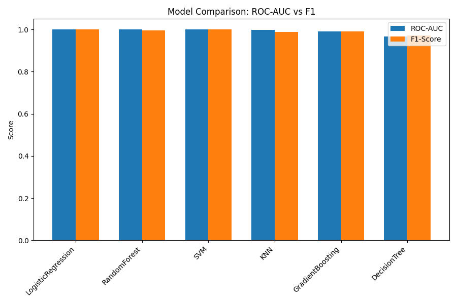
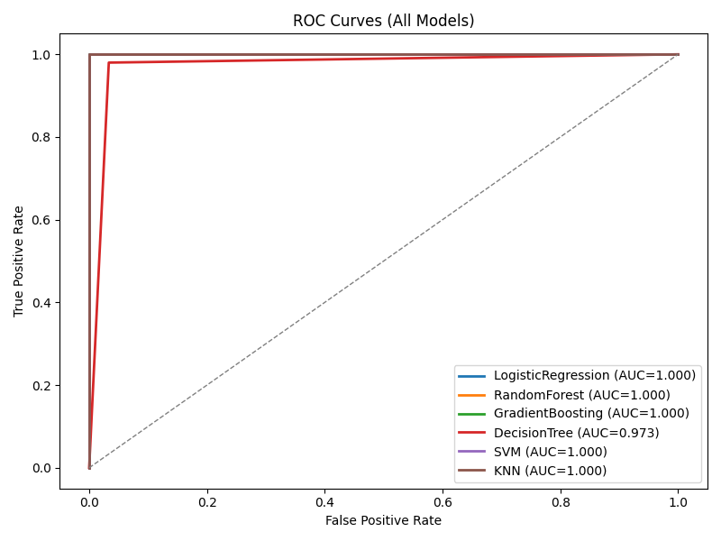
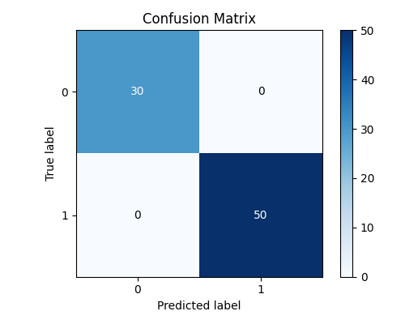
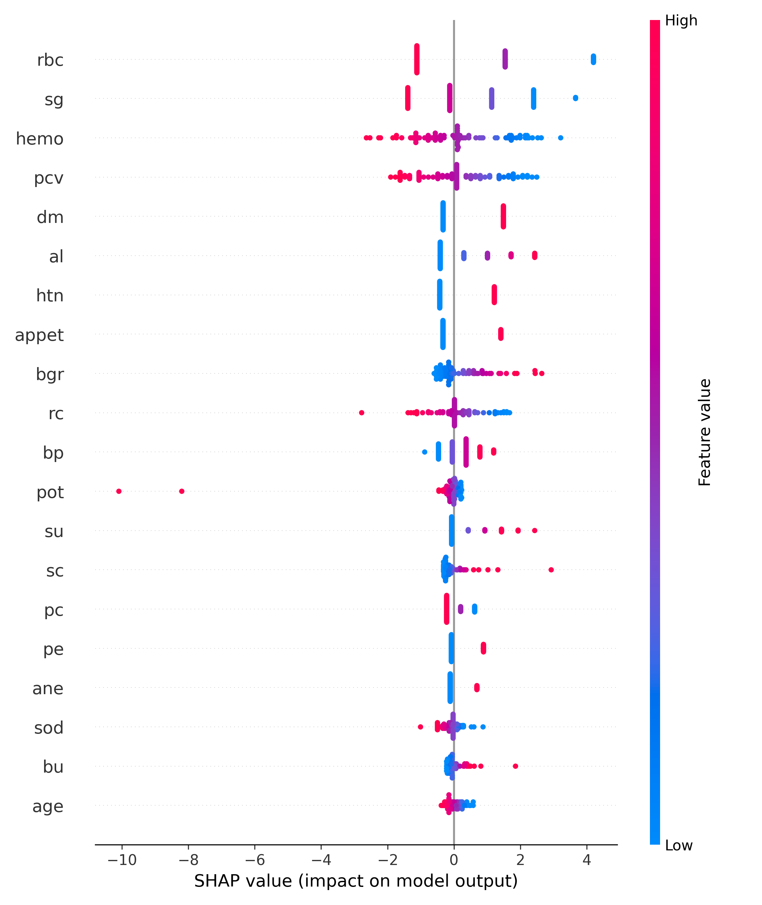
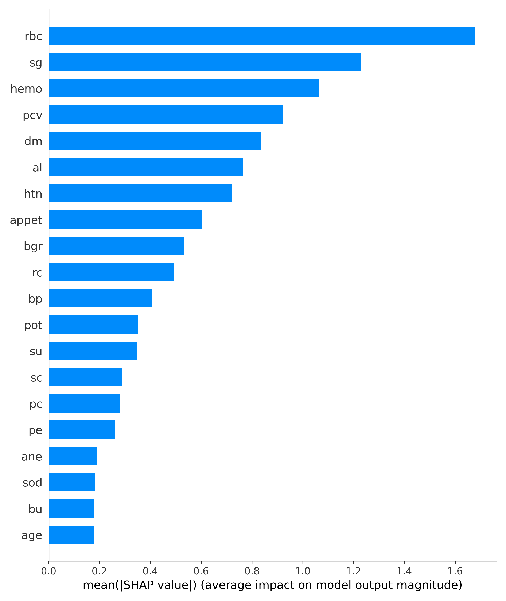
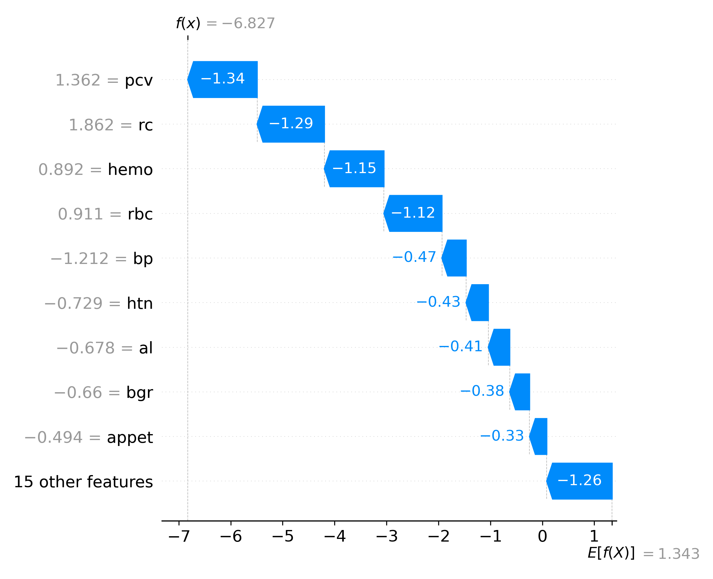
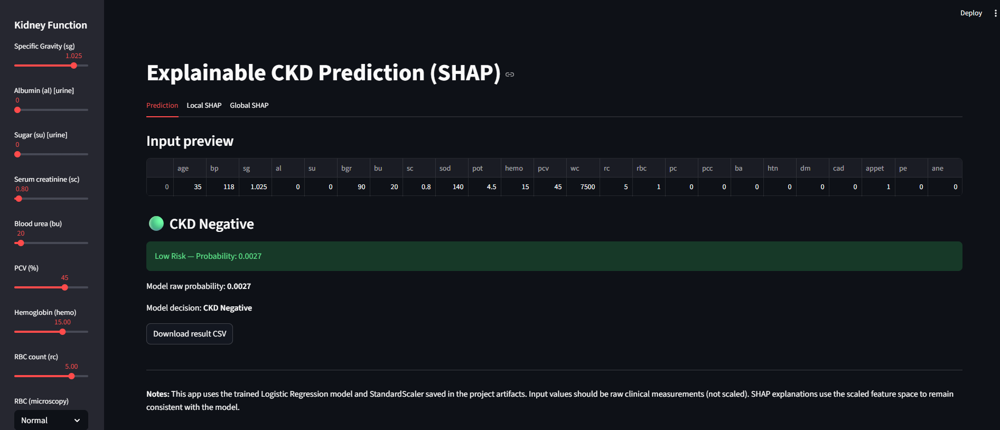
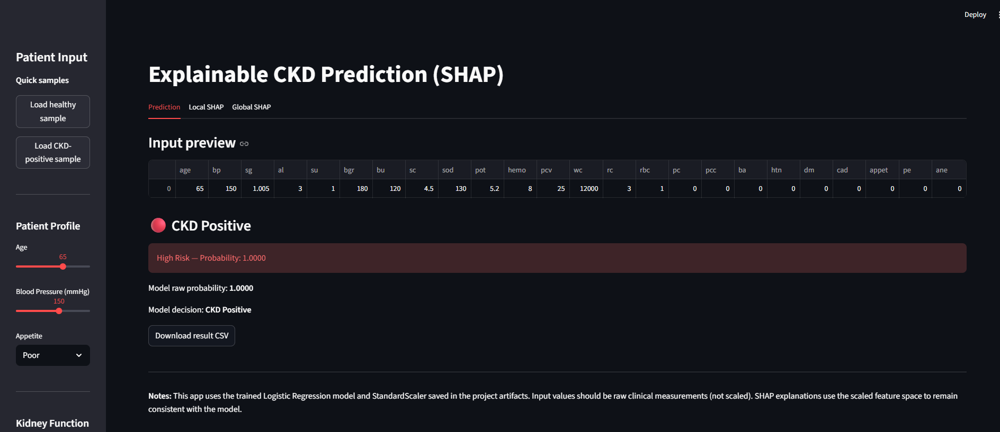

# Chronic Kidney Disease Prediction using Explainable AI (XAI)


An interpretable machine learning system for early prediction of Chronic Kidney Disease (CKD) using Logistic Regression and SHAP-based Explainable AI (XAI).

The project combines predictive analytics with model transparency, enabling users to understand not only the prediction outcome but also the clinical factors that contribute to it.

---

## Overview

Chronic Kidney Disease (CKD) is a progressive condition that can lead to kidney failure if not detected early.

This project develops an Explainable AI framework that:

- Predicts CKD risk from clinical measurements
- Provides prediction probabilities
- Generates patient-level explanations using SHAP
- Visualizes global feature importance
- Offers an interactive Streamlit-based user interface

Unlike traditional black-box machine learning systems, this framework emphasizes interpretability and transparency.

---

## Key Features

### Machine Learning Prediction

- Logistic Regression based CKD classification
- Multiple model comparison framework
- Probability-based risk assessment
- Automated preprocessing pipeline

### Explainable AI (XAI)

- SHAP Summary Plot
- SHAP Feature Importance Plot
- SHAP Waterfall Plot
- Patient-level explanation generation

### Interactive Application

- Streamlit web interface
- Clinical parameter input
- Real-time prediction
- Downloadable prediction results

---

## System Workflow



### Workflow Steps

1. Dataset Loading
2. Data Cleaning
3. Missing Value Imputation
4. Feature Encoding
5. Feature Scaling
6. Train-Test Split
7. Model Training
8. Model Evaluation
9. SHAP Explainability
10. Streamlit Deployment

---

## Dataset

### Chronic Kidney Disease Dataset

Dataset Characteristics:

- Total Records: 400
- Clinical Features: 24
- Target Classes:
  - CKD
  - Non-CKD

Clinical attributes include:

- Age
- Blood Pressure
- Specific Gravity
- Albumin
- Blood Glucose Random
- Serum Creatinine
- Hemoglobin
- Packed Cell Volume
- Diabetes Mellitus
- Hypertension
- Red Blood Cell Status
- And other laboratory indicators

---

## Models Evaluated

The following machine learning algorithms were evaluated:

- Logistic Regression
- Random Forest
- Gradient Boosting
- Decision Tree
- Support Vector Machine (SVM)
- K-Nearest Neighbors (KNN)

Although multiple models achieved strong predictive performance, Logistic Regression was selected as the final deployed model because of its interpretability and compatibility with SHAP explanations.

---

## Model Evaluation

### Model Comparison



### ROC Curves



### Confusion Matrix



---

## Explainable AI (SHAP)

The project integrates SHAP (SHapley Additive Explanations) to provide transparent model behavior.

### SHAP Summary Plot



### SHAP Feature Importance



### SHAP Waterfall Explanation



These visualizations help explain:

- Which clinical factors influence predictions
- Positive and negative feature contributions
- Individual patient-level decisions
- Global model behavior

---

## Application Screenshots

### Healthy Prediction Example



### CKD Prediction Example



---

## Project Structure

```text
chronic-kidney-disease-prediction-xai/
│
├── app/
│   └── app.py
│
├── data/
│   ├── raw/
│   └── processed/
│
├── docs/
│
├── models/
│
├── outputs/
│   └── shap/
│
├── screenshots/
│
├── src/
│   ├── artifacts/
│   ├── prepare_data.py
│   ├── train_models.py
│   └── explainability.py
│
├── requirements.txt
├── .gitignore
├── LICENSE
└── README.md
```

---

## Installation

Clone the repository:

```bash
git clone https://github.com/AdityaPansare1408/chronic-kidney-disease-prediction-xai.git

cd chronic-kidney-disease-prediction-xai
```

Install dependencies:

```bash
pip install -r requirements.txt
```

---

## Run the Application

```bash
streamlit run app/app.py
```

---

## Technologies Used

### Programming Language

- Python

### Machine Learning

- Logistic Regression
- Scikit-Learn

### Explainable AI

- SHAP (SHapley Additive Explanations)

### Data Processing

- Pandas
- NumPy

### Data Visualization

- Matplotlib

### Web Application

- Streamlit

### Model Serialization

- Joblib

### Data Preprocessing

- Imbalanced-Learn

---

## Future Improvements

- Advanced ensemble models
- Additional explainability techniques
- Real-time healthcare dashboard
- Cloud deployment
- Clinical decision-support integration

---

## Disclaimer

This project is intended for educational and research purposes only.

It is not a certified medical diagnostic system and should not be used as a substitute for professional medical advice.

---

## Author

**Aditya Pansare**

M.Tech Computer Engineering  
Pune Institute of Computer Technology (PICT)

---

## License

This project is licensed under the MIT License.

See the LICENSE file for details.
